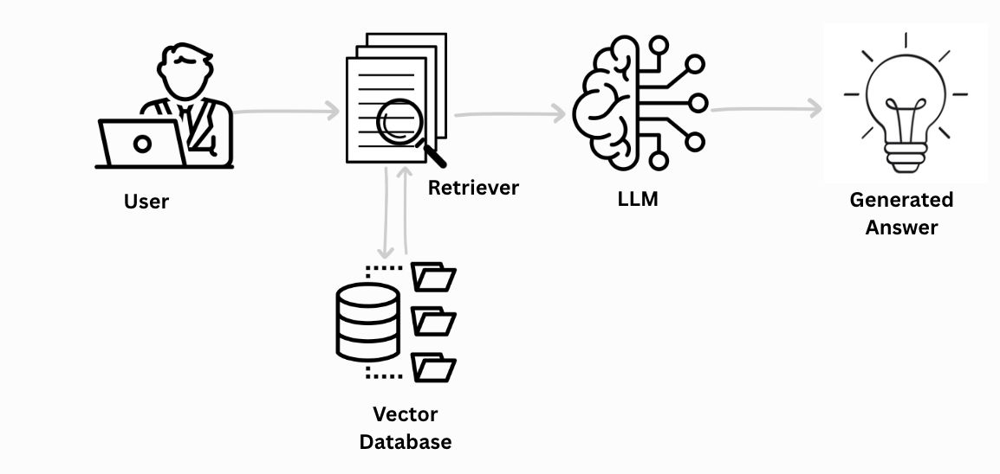
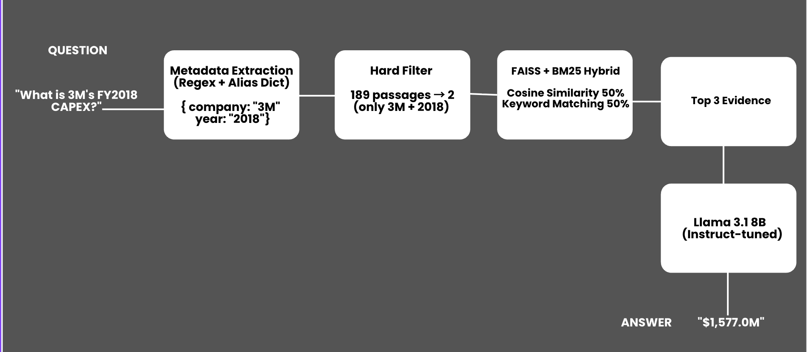

# 🏦 AI Powered Financial Document Analysis
### Can an open-source 8B model match GPT-4 on financial QA?

**Dataset:** FinanceBench — 150 questions across 32 companies (53 Numerical | 37 Yes/No | 60 Descriptive)  
**Focus:** Numerical accuracy on 10-K financial reports  
**Benchmark:** GPT-4-Turbo + Basic RAG = 19% overall (FinanceBench paper)

---

## 📈 Numerical Accuracy — Progress Across Versions

| Version | Approach | Numerical Accuracy |
|---------|----------|--------------------|
| V1 | Basic RAG (FAISS only) | 17.0% (9/53) |
| V2 | Metadata + BM25 + Statement Routing | 32.1% (17/53) |
| V3 | Agentic RAG (ReAct + Calculator) | **41.5% (22/53)** |
| 📄 GPT-4-Turbo (paper baseline) | Basic RAG | 19.0% overall |

> **V3 open-source 8B model achieves 41.5% numerical accuracy —
> more than double the GPT-4-Turbo baseline, at zero API cost.**

---

## 🗂️ Repo Structure

```
financial-document-analysis/
│
├── README.md
├── v1_basic_rag/
│   └── llama_basic_rag.ipynb
├── v2_metadata_bm25_routing/
│   └── llama_rag_pipeline.ipynb
├── v3_agentic_rag/
│   └── Llama_3_3_8B_agentic.ipynb
├── results/
│   ├── v2_results.csv
│   └── v3_agent_results.csv
└── assets/
    ├── pipeline_v2.png
    └── pipeline_v3.png
```

---

## V1 — Basic RAG (FAISS only)

**Question:** Does RAG help on numerical financial questions?  
**Answer:** Yes — but wrong document retrieval kills accuracy.



| Metric | No RAG | + Basic RAG |
|--------|--------|-------------|
| Numerical Accuracy | 5.7% | 17.0% |
| Hallucination Rate | 67.9% | 22.6% |
| Citation Rate | 0% | 55% |

**Problem discovered:**

```
Question: "What is 3M's FY2018 CAPEX?"

FAISS retrieves:
  [1] 3M_2022_10K Cash Flow  ← wrong year
  [2] 3M_2023_10Q Balance    ← wrong year
  [3] 3M_2018_10K Cash Flow  ← correct, but ranked last
```

Cosine similarity can't distinguish 3M's 2018 from 2022 filing —
the text is nearly identical. Same table structure, same headings.
Only the numbers and year differ. The model confidently extracts
a number from the wrong document.

📁 [v1_basic_rag/](./v1_basic_rag/)

---

## V2 — Metadata + BM25 + Statement Routing

**Question:** Can smarter retrieval fix wrong document ranking?  
**Answer:** Yes — retrieval IS the bottleneck, not model size.



### 3 Levels of Retrieval Failure → 3 Fixes

| Level | Problem | Fix | Numerical Accuracy |
|-------|---------|-----|--------------------|
| 1 | Wrong company / year | Metadata Hard Filter | 18.9% |
| 2 | Exact term mismatch | BM25 Hybrid Search | 20.8% |
| 3 | Wrong statement type | Statement Routing | **32.1%** |

### How Each Fix Works

**Fix 1 — Metadata Hard Filter**  
Extract company name and fiscal year from the question using regex,
then hard-filter the vector store before searching.
Now a question about 3M 2018 only sees 3M 2018 documents.
It can't be confused by 3M 2022.

**Fix 2 — BM25 Hybrid Search**  
FAISS matches meaning but misses exact financial terms.  
BM25 catches exact keywords like `"purchases of property, plant and equipment"`.  
Combining both (50/50) gives the best of both worlds.

**Fix 3 — Statement Routing**  
Even with the right company and year, there are 3 statement types
per filing. Semantic search can't tell which one the question needs.
Solution: map financial keywords to statement types before retrieval.

```
"capex" / "purchases of PP&E"       → Cash Flow Statement
"revenue" / "operating income"      → Income Statement
"assets" / "liabilities" / "equity" → Balance Sheet
```

```
Before Statement Routing:
  [1] 3M_2018_10K — Balance Sheet   ← WRONG

After Statement Routing:
  [1] 3M_2018_10K — Cash Flow ✅    ← CORRECT
```

Statement routing alone nearly doubled numerical accuracy: **17% → 32.1%**  
Same model. Same prompts. Only retrieval changed.

### Key Insight from FinanceBench Paper

GPT-4-Turbo jumps from 19% → 85% when given the exact correct evidence page.  
That **66-point gap** proves the bottleneck is retrieval quality — not model size.  
Our experiments confirm this exactly: every retrieval improvement
directly increased accuracy with no model changes.

### Remaining Failures After V2

After manual inspection of the 36 wrong answers:

| Failure Type | Example |
|-------------|---------|
| Math hallucination | Fixed asset turnover pred: 1.97 vs gold: 24.26 |
| Wrong year for multi-year comparisons | Revenue change pred: 5.1% vs gold: 30.8% |
| Wrong number extracted from right doc | Adobe pred: 0.73 vs gold: 0.66 |

The model never actually did math — it pattern-matched.  
For ratio questions, it grabbed a random number from the text.

📁 [v2_metadata_bm25_routing/](./v2_metadata_bm25_routing/)

---

## V3 — Agentic RAG (ReAct + Tools)

**Question:** What can an agent fix that better retrieval can't?  
**Answer:** Math and multi-year comparisons.

> 🚧 Architecture diagram coming soon

### V2 Failures → Agentic Fixes

| Failure | Root Cause | Agentic Fix |
|---------|-----------|-------------|
| Math hallucination | 8B model pattern-matches, doesn't compute | Python Calculator Tool |
| Wrong year for comparisons | Single retrieval misses historical data | Multi-Hop Retrieval |
| Unverified answers | No grounding check after generation | Retry with alternate statement type |

### How the Agent Reasons (ReAct Loop)

```
# Ratio Question — Fixed Asset Turnover
Step 1: Retrieve income statement → revenue = $6,489M
Step 2: Retrieve balance sheet   → net PP&E = $267M
Step 3: Write formula            → 6489 / 267
Step 4: Calculator executes      → 24.29 ≈ gold 24.26 ✅

LLM handles reasoning. Python handles arithmetic.
```

```
# Multi-Year Question — Amazon Revenue Growth
Step 1: Retrieve FY2016 → $135,987M
Step 2: Retrieve FY2017 → $177,866M
Step 3: Calculator      → (177,866 - 135,987) / 135,987 = 30.8% ✅

Agent fires separate retrieval calls per year, then aggregates.
```

```
# Direct Lookup — 3M FY2018 CAPEX
Step 1: Retrieve Cash Flow Statement
Step 2: Extract capital expenditure = $1,577M
Step 3: No calculation needed
Step 4: Verify number exists in evidence → VERIFIED ✅
```

### V3 Numerical Results

| Metric | Score |
|--------|-------|
| Numerical Accuracy | **41.5% (22/53)** |
| Calculator Used | 19/53 questions |
| Answers Verified | 31/53 questions |
| Citation Rate | **100%** |
| Retry Retrieval | 4/53 questions |

**Notable:** Calculator was triggered selectively on 19/53 questions —
meaning the agent correctly distinguished direct lookups (no math needed)
from ratio questions (math required). Every numerical answer is
now backed by a cited source (100% citation rate).

### Full Results Comparison

| Metric | V1 Basic RAG | V2 Smart Retrieval | V3 Agentic RAG |
|--------|-------------|-------------------|----------------|
| Numerical Accuracy | 17.0% | 32.1% | **41.5%** |
| Hallucination Rate | 22.6% | — | 45.3% |
| Citation Rate | 55% | — | **100%** |
| Calculator Used | — | — | 19/53 |
| Answers Verified | — | — | 31/53 |

📁 [v3_agentic_rag/](./v3_agentic_rag/)

---

## 🔬 Research Findings

1. **Retrieval is the bottleneck** — not model size. Every accuracy
   gain came from better retrieval, confirmed by the FinanceBench
   paper's 19% → 85% oracle gap.

2. **Statement routing is underrated** — a simple keyword-to-statement
   map nearly doubled numerical accuracy (17% → 32.1%) with no
   model changes.

3. **Agents fix what retrieval can't** — for math-heavy ratio questions,
   offloading arithmetic to a Python calculator is more reliable than
   trusting an 8B LLM to compute.

4. **Open-source is viable** — Llama 3.1 8B at 41.5% numerical
   accuracy outperforms GPT-4-Turbo's 19% baseline at zero API cost.

---

## 🛠️ Tech Stack

| Component | Technology |
|-----------|------------|
| Base Model | Llama 3.1 8B (Instruct) |
| Vector Search | FAISS |
| Keyword Search | BM25 (rank-bm25) |
| Embeddings | SentenceTransformers (all-MiniLM-L6-v2) |
| Agent Framework | Custom ReAct loop |
| Fine-tuning | QLoRA (HuggingFace PEFT) |
| Dataset | FinanceBench (150 questions, 32 companies) |
| Language | Python |

---

## 📄 Reference

> Islam et al., *FinanceBench: A New Benchmark for Financial Question Answering* (2023)
